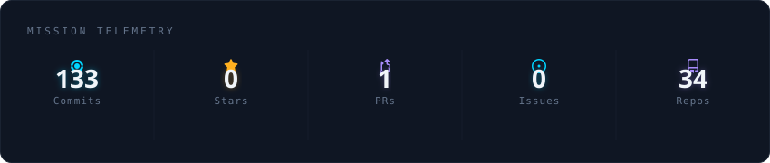

# Leonardo Henrique de Figueiredo | Data Analyst & AI Systems Engineer

**Mission:** Engineering high-performance local AI systems, autonomous agentic workflows, and scalable data analytics to solve complex business problems.

* **AI & Local LLMOps:** Autonomous Agents ([Apex Harness](https://github.com/leohfigueiredo/apex-harness)), Hybrid RAG, Declarative Attention ([arXiv:2609.02737](https://arxiv.org/abs/2609.02737)), llama.cpp, GGUF, MCP, ROCm/Vulkan/AVX-512.
* **Data & Analytics:** SQL, Python, PostgreSQL, Tableau, ETL Pipelines, Statistical Analysis, Catastrophe Risk & Exposure Management (AIR / RMS).
* **Systems & Engineering:** Linux, Docker, Git, IoT Systems & Hardware Architecture (ICIP).
* **Academic:** Post-Grad Specialist in Data Engineering & AI @ SENAI | MBA in Production & Quality @ UNIFACEAR | B.Eng. in Electrical Engineering @ UERJ.
* **Experience:** Product Success Analyst @ NIQ | Ex-Data Analyst @ PRO-GLOBAL.

## Contact & Social:
    

## Certifications:

  
  &nbsp;&nbsp;
  
  &nbsp;&nbsp;
  
  &nbsp;&nbsp;
  
  &nbsp;&nbsp;
  
  &nbsp;&nbsp;
  

---

  

  

 

  

 

  

<picture>
  <source
    media="(prefers-color-scheme: dark)"
    srcset="https://raw.githubusercontent.com/platane/snk/output/github-contribution-grid-snake-dark.svg"
  />
  <source
    media="(prefers-color-scheme: light)"
    srcset="https://raw.githubusercontent.com/platane/snk/output/github-contribution-grid-snake.svg"
  />
  
</picture>

